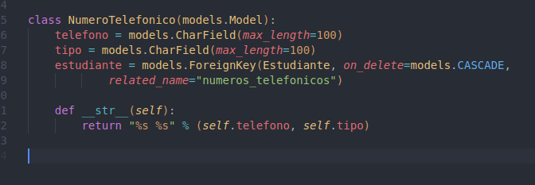
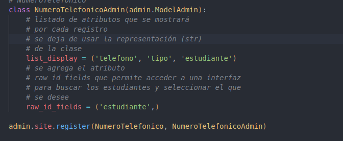

# clase03-2bim

Es porque Django usa una sintaxis espacial de ellos para separar lógica y presentación:  para estructuras de control, {{ ... }} para mostrar datos.
 este se necesita para poder cerrar  con  igual que los ifs

Tambien el uso del .all en e.numerotelefonico_set.all es porque se esta accediendo a una relación reversa de una ForeignKey desde Estudiante a 

### 25 junio 2025

Me permite registrar números telefónicos asociados a un estudiante mediante un formulario personalizado y este modelo NumeroTelefonico contiene campos para el número, tipo y la relación con un estudiante el cual tiene un formulario que se asigna automáticamente al estudiante y oculta ese campo para evitar errores.
En el panel de administración, se facilita la búsqueda del estudiante. Así, cada teléfono se guarda correctamente vinculado a su respectivo estudiante de forma eficiente.

Modelo NumeroTelefonico

telefono: almacena el número como texto

tipo: guarda el tipo de número

estudiante: crea una relación con un objeto de tipo Estudiante mediante una clave foránea.

list_display: muestra las columnas telefono, tipo y estudiante en el panel de administración.

raw_id_fields: reemplaza el desplegable por un campo de búsqueda para seleccionar estudiantes (útil si hay muchos registros).
