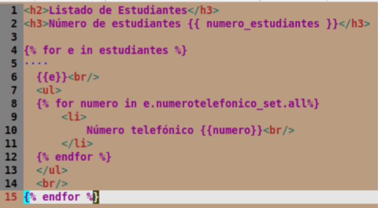

# clase03-2bim

Es porque Django usa una sintaxis espacial de ellos para separar lógica y presentación:  para estructuras de control, {{ ... }} para mostrar datos.
 este se necesita para poder cerrar  con  igual que los ifs

Tambien el uso del .all en e.numerotelefonico_set.all es porque se esta accediendo a una relación reversa de una ForeignKey desde Estudiante a NumeroTelefonico
